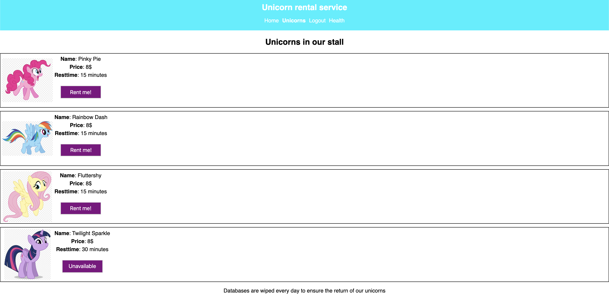

# Unicorn Rental Service

- [Global Information](#global-information)
- [Setups and execution of the project](#setups-and-execution-of-the-project)

## Global information

[Heroku Demo](https://unicornrentalservice.herokuapp.com/)

[Github](https://github.com/Ojself/UnicornRentalService)

This application is the result of a code-challenge given to by a German company for a backend developer position.

Rules of the code-challenge can be found in
./unicorn-rental.pdf

Small note about healtz endpoint. I do not recommend to put the server health visible in the frontend like this project. It should be only accessible by logged in users that has admin-role.

## Set up and execution of the project

**To download the application and link it with your GitHub project**

(replace `<my-project>` and `<https://github.com/user/my-project.git>` by what you want, without `<` and `>`).

```sh
# Clone the project with only the last commit and save it in the folder <my-project>
$ git clone --depth=1 https://github.com/Ojself/UnicornRentalService.git <my-project>

$ cd <my-project>
$ rm -rf .git
$ git init

# Set your GitHub repository as the "origin" remote repository
$ git remote add origin <https://github.com/user/my-project.git>
```

### Files to add

You should have a `server/.env` file, with for example the following values:

```
PORT=5000
SESSION_SECRET=anyValue
MONGODB_URI=......
```

**To install all the packages**

```sh
# Install server and client packages + build the React applicatin
$ npm install

# OR you can install manually the server and client packages
$ (cd server && npm install)
$ (cd client && npm install)
```

**To install a package for the server**

```sh
$ cd server
$ npm install axios
```

**To install a package for the client**

```sh
$ cd client
$ npm install axios
```

**To run the server and the client**

```sh
# Open a first terminal
$ npm run dev:server
# Run the server on http://localhost:5000/

# Open a second terminal
$ npm run dev:client
# Run the client on http://localhost:3000/
```

So now you can go to

- http://localhost:5000/api/: A simple API call
- http://localhost:5000/: The website based on client/build (that you can update with `$ (cd client && npm run build)`)
- http://localhost:3000/: The last version of your React application that is calling your API with the base url "http://localhost:5000/api/"

### Directory structure

```
.vscode/
client/
    build/
    public/
    src/
        components/
            pages/
    package.json
server/
    bin/
    configs/
    models/
    passport/
    routes/
    utils/
    app.js
    middlewares.js
    package.json
.gitignore
package.json
README.md
```

### `server/routes/auth.js`

- `router.post('/signup')`: Route to create a new user
- `router.post('/login')`: Route to send the user JWT
  authenticated

### `server/routes/unicorns.js`

- `router.get('/unicorns/rentals')`: Route to get all unicorns
- `router.post('/unicorns/rentals')`: Route to rent a unicorn
- `router.patch('/unicorns/rentals')`: Route to return a unicorn

### `server/routes/index.js`

- `router.get('/user')`: Route to get logged in user

### `server/routes/healtz.js`

- `router.get('/healtz')`: Route to get status of server

### To execute a seed

If you want to seed the Mongo-database with the unicorns and two users:

```
$ node server/bin/seeds.js
```

<!-- Todo, health route -->
